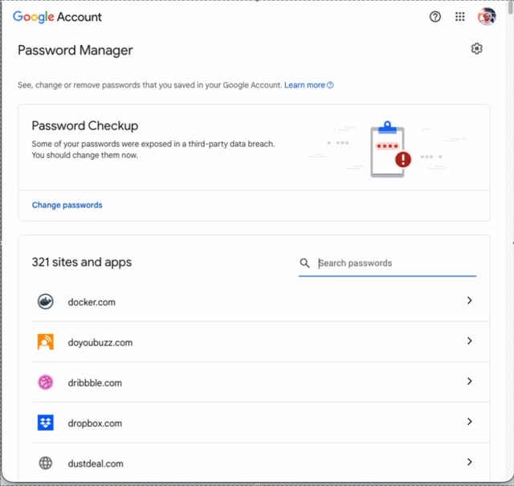

# Delete Google Passwords

Automates deleting all saved passwords from Google Password Manager using Playwright.





## What this tool does

- Connects to an existing Chrome session (no automated login)
- Navigates to your saved passwords
- Opens each entry and confirms deletion
- Supports multiple UI languages via translation files

## Why

Google Password Manager does not provide a one-click way to delete all saved passwords at once. 

After having migrated to 1password, I was looking for a solution to delete them all.
The password manager page is for obvious reasons heavily protected, and Google is not happy to let scripts or bots log in and automate it directly. Because of that, this script does not try to log in for you. Instead, it attaches to a Chrome window that you start yourself, so you can authenticate normally first and then let the script perform the repetitive deletion work. At some point Google asked me to change my password completely.

Google will ask you multiple times to confirm your identity. If the script fails at some point, you can simply stop it (`Ctrl C`) and restart it where you left until you have deleted all your passwords. Still faster and less tedious than doing it by hand. 

Tested and working as of April 1, 2026. Google may change the UI at any time.

This project uses Playwright to connect to a real Google Chrome session and delete saved passwords from [passwords.google.com](https://passwords.google.com).

The workflow in this README is primarily for macOS. A Windows launch example is included below, but it has not been tested.

## Requirements

- Node.js 18 or newer
- Google Chrome installed (on Mac at `/Applications/Google Chrome.app`)
- Your passwords already exported somewhere safe

## Supported languages

The script ships with translation files for:

- English: `en`
- Finnish: `fi`
- Swedish: `sv`
- German: `de`
- French: `fr`
- Polish: `pl`
- Irish: `ga`

The translation files live in:

- [`translations/`](translations/)

It is very easy to extend it with your own translations.

## Install

From this folder:

```bash
npm install
```

## Run

1. Start Chrome with remote debugging enabled and a dedicated profile folder.

On macOS:

```bash
"Google Chrome" --remote-debugging-port=9222 --user-data-dir=./chrome-profile
```

On Windows, in `cmd.exe` or PowerShell, (not tested):

```powershell
"C:\Program Files\Google\Chrome\Application\chrome.exe" --remote-debugging-port=9222 --user-data-dir=.\chrome-profile
```

2. In another terminal, start the script:

```bash
npm run delete-passwords
```

3. In the Chrome window you opened:

- Go to `https://passwords.google.com`
- Log in normally if needed
- Make sure the password list is visible
- You may have to confirm your identity at different points

4. Return to the terminal running the script and press `Enter`.

The script will then start opening entries and clicking the delete confirmation flow.It can delete multiple entries on the same page and presses the confirmation delete button.

## Customizing language

By default, the script automatically loads every `*.json` file in [`translations/`](translations/).

To add your own language:

1. Create a new file like `translations/es.json`
2. Use the same JSON structure as the other files
3. Run the script again

No code changes are needed.

If you want to add or tweak language support, edit or add JSON files in:

- [`translations/`](translations/)

Expected JSON shape:

```json
{
  "delete": ["delete"],
  "cancel": ["cancel"],
  "back": ["back"],
  "username": ["username"],
  "password": ["password"]
}
```

## Optional: custom DevTools URL

By default the script connects to:

```bash
http://127.0.0.1:9222
```

If Chrome is exposed on a different host or port, set `CHROME_DEBUG_URL`:

```bash
CHROME_DEBUG_URL=http://127.0.0.1:9333 npm run delete-passwords
```

## Repository hygiene

The dedicated Chrome profile is stored in:

- [`chrome-profile/`](chrome-profile/)

That folder contains temporary Chrome state such as `Local State`, `Variations`, caches, cookies, and profile data. It is ignored in git via:

- [`.gitignore`](.gitignore)

## Troubleshooting

### `connect ECONNREFUSED 127.0.0.1:9222`

Chrome is not listening on that port yet.

Try this:

- Close any existing Chrome windows
- Start Chrome again with `--remote-debugging-port=9222`
- Open [http://127.0.0.1:9222/json/version](http://127.0.0.1:9222/json/version) in a browser

If that URL does not return JSON, the Playwright script will not be able to connect.

### Google says the browser is insecure

Do not log in through a Playwright-launched browser.

Instead:

- Start Chrome yourself
- Log in manually in that real Chrome window
- Let the script attach after login

### The script cannot find entries or buttons

Google can change the UI at any time, and button labels may differ by language.

If the script stops with a selector-related error:

- Inspect the page and update the relevant JSON file in [`translations/`](translations/)

## Safety Notes

- Make sure your passwords are already imported into 1Password before running this.
- Consider deleting a small batch first to confirm the flow works on your account.
- This script performs destructive actions. There is no undo in the script.

